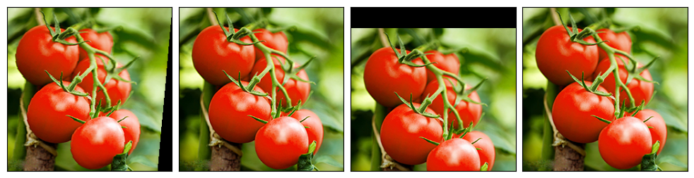

# Data Augmentation 

Data augmentation is the process of artificially generating new data from existing data, primarily to train new machine learning (ML) models.


## Non-Random Transforms

### ● Pad Transform
```
padded_imgs = [transforms.Pad(padding=padding, fill=125, padding_mode='reflect')(original_img) for padding in (5, 15, 20, 45)]
```

_Output_


### ● Resize Transform
```
resize_imgs = [transforms.Resize(size=size) (original_img) for size in (30, 50 , 100, original_img.size)]
```

_Output_


### ● CenterCrop Transform
```
centerCrop_imgs = [transforms.CenterCrop(size=size) (original_img) for size in (30, 50 , 100, original_img.size)]
```

_Output_


### ● FiveCrop Transform
```
(top_left, top_right, bottom_left, bottom_right, center) = transforms.FiveCrop(size=(100, 100)) (original_img)
```

_Output_


## Random Transforms

### ● ColorJitter Transform

_First Ouput_


_Second Output_


### ● RandomPerspective Transform

_First Ouput_


_Second Output_


### ● RandomRotation Transform

_First Ouput_


_Second Output_


### ● RandomCrop Transform

_First Ouput_


_Second Output_


### ● RandomVerticalFlip Transform

_First Ouput_


_Second Output_


## Auto Augmentation

### ● RandAugment Transform

_First Output_



_Second Output_


### ● AugMix Transform

_First Output_


_Second Output_


